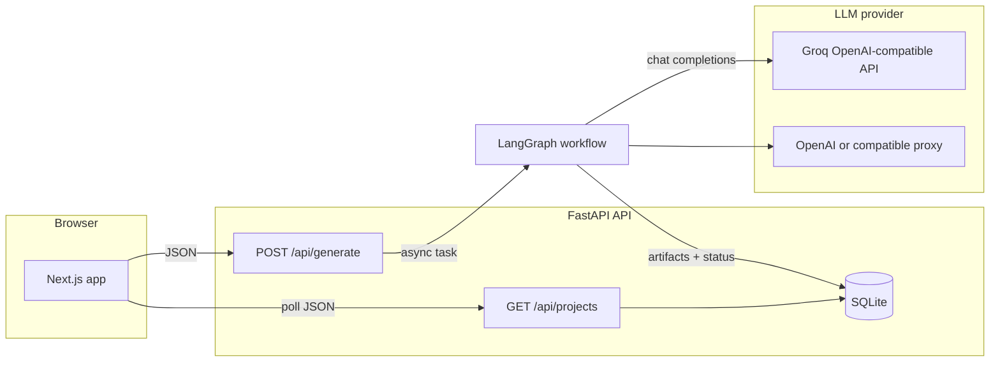

# ForgeFlow

Turn a short product idea into structured MVP scope, architecture, starter scaffold, review, and a delivery pack (README, demo script, checklist) using a **multi-step LLM workflow** orchestrated with **LangGraph**. This README explains how everything fits together, why each piece exists, and how to run and configure it.

---

## Why ForgeFlow exists

Building from an idea usually means repeating the same early steps: clarify the product, cut scope for an MVP, sketch architecture, stub a repo layout, sanity-check risks, and write onboarding docs. ForgeFlow automates that **sequence** with specialized prompts (agents), each consuming the previous step’s JSON so later steps stay aligned with earlier decisions. You use it when you want **fast, consistent planning artifacts** to hand to engineers or to iterate on before writing production code.

---

## High-level architecture



1. The **web UI** submits an idea and receives a `project_id` immediately.
2. The API **persists** a project row and starts **`run_workflow`** in a background `asyncio` task (the HTTP request does not wait for all LLM calls).
3. The **workflow** runs six LLM-backed nodes in order, updating a shared **state** object.
4. When the graph finishes, the API writes **`artifacts`** (JSON blob) and sets **`status`** to `done` (or stores an error string).
5. The UI **polls** `GET /api/projects/{id}` until `status` is `done` or starts with `error`.

---

## Repository layout

| Path | Role |
|------|------|
| `apps/api/` | FastAPI app: routes, LangGraph graph, agents, SQLite storage, LLM client |
| `apps/api/agents/` | Six async functions; each calls the LLM and returns a partial state update |
| `apps/api/graph/` | `WorkflowState` (TypedDict) + `workflow.py` (graph edges and compile) |
| `apps/api/routes/` | HTTP: `generate`, `projects` |
| `apps/api/services/` | `llm.py` (OpenAI-compatible client), `json_llm.py` (parse model JSON), `storage.py` (SQLite) |
| `apps/web/` | Next.js 14 UI: forms, project page, tabs for artifacts |
| `apps/web/lib/api.ts` | Typed `fetch` helpers for the backend |
| `infra/docker/` | Optional Compose stack for API + web |
| `start.sh` | Dev helper: frees ports 8000/3000, venv, `pip install`, starts uvicorn + `npm run dev` |

---

## Agent pipeline (LangGraph)

The graph is a **linear state machine**: one entry node, fixed edges, no cycles. LangGraph is used because it gives a clear **orchestration model** (nodes, state schema, compilation) instead of ad-hoc `await` chains, and it enforces that each step receives the **full accumulated state** (idea, scope, architecture, etc.).

**Important:** LangGraph does not allow a **node name** to equal a **key** in the state schema. The workflow uses node ids `scaffold_agent` and `delivery_agent` while state keys remain `scaffold` and `delivery`.

```
intake → pm → architect → scaffold_agent → reviewer → delivery_agent → END
```

| Step | Agent | Input (from state) | Output (state keys) |
|------|--------|---------------------|----------------------|
| 1 | Intake | `idea`, `stack`, … | `parsed_input` |
| 2 | PM | `parsed_input`, … | `scope` |
| 3 | Architect | `scope`, … | `architecture` |
| 4 | Scaffold | `architecture`, `scope`, … | `scaffold` |
| 5 | Reviewer | scope, architecture, scaffold, … | `review` |
| 6 | Delivery | accumulated context | `delivery` |

Each agent calls `services.llm.chat(...)` with **`json_mode=True`** so the provider is asked for a **JSON object** (`response_format` OpenAI-style). Parsed output goes through **`parse_llm_json_object`** (strip markdown fences, `json.loads`, then `JSONDecoder.raw_decode` from the first `{`) so small formatting mistakes from the model do not always destroy the run.

---

## Backend HTTP API

| Endpoint | Method | Behavior |
|----------|--------|------------|
| `/api/generate/` | POST | Body: `idea`, `stack`, `team_size`, `deadline`, `constraints`. Creates DB row, returns `{ project_id, status: "running" }`, runs workflow in background. |
| `/api/projects/` | GET | Lists projects (newest first in storage implementation). |
| `/api/projects/{id}` | GET | Single project: metadata + `artifacts` JSON + `status`. |
| `/api/generate/stream/{project_id}` | GET | SSE: polls DB every 2s, up to ~2 minutes; optional for live UI. |
| `/health` | GET | Liveness. |
| `/docs` | GET | OpenAPI (Swagger UI). |

**CORS** is restricted to `http://localhost:3000` and `http://127.0.0.1:3000` so browser calls from the dev Next app work without opening the API to all origins.

---

## Persistence (SQLite)

- **File:** `apps/api/data/forgeflow.db` (created on first use).
- **Table `projects`:** id, title, idea, stack, team_size, deadline, constraints, **status** (string: `pending`, `running`, `done`, or `error: …`), **artifacts** (JSON text of all agent outputs), timestamps.
- **Why SQLite:** zero external services for hackathons and local demos; swap implementation later for Postgres if you add `DATABASE_URL` logic.

---

## LLM layer (`services/llm.py`)

### Why OpenAI’s Python client

The app uses **`AsyncOpenAI`** from the official **`openai`** package because many providers (Groq, vLLM, LiteLLM proxies, etc.) expose an **OpenAI-compatible** `/v1/chat/completions` API. One client supports multiple hosts via `base_url` and the same request shape.

### Provider selection

1. If **`GROQ_API_KEY`** is set → client uses `https://api.groq.com/openai/v1` with that key (free tier suitable for demos).
2. Else **`OPENAI_API_KEY`** is required → optional **`OPENAI_BASE_URL`** for self-hosted or other proxies.

### Model defaults

- Groq: **`LLM_MODEL`** defaults to `llama-3.1-8b-instant` if unset.
- OpenAI path: defaults to `gpt-4o-mini` if unset.

### Why `httpx==0.27.2` is pinned

`openai==1.35.3` passes a `proxies` argument into httpx. **httpx 0.28+** removed that parameter, which caused `AsyncClient.__init__() got an unexpected keyword argument 'proxies'`. Pinning **httpx 0.27.2** keeps this OpenAI SDK version working until you upgrade the `openai` package to one fully compatible with httpx 0.28+.

### Timeouts and retries

- **`LLM_HTTP_TIMEOUT_SECONDS`** (default `900`): per-request read budget; long scaffold JSON can need minutes.
- **`LLM_HTTP_MAX_RETRIES`** (default `5`): transient HTTP failures.

### JSON mode and 400 fallback

When **`json_mode=True`**, the client adds `response_format: { "type": "json_object" }`. If the server returns **400** (model or host does not support the flag), the client **retries once** without `response_format` so older endpoints still work.

---

## Environment variables (`apps/api/.env`)

Copy from **`apps/api/.env.example`** and edit **`apps/api/.env`** (never commit real keys).

| Variable | Required when | Purpose |
|----------|------------------|---------|
| `GROQ_API_KEY` | Using Groq | Bearer token from Groq Console. |
| `OPENAI_API_KEY` | No Groq key | OpenAI or proxy auth. |
| `OPENAI_BASE_URL` | Optional | Override API base (vLLM, Azure-style proxies, etc.). Leave empty for api.openai.com. |
| `LLM_MODEL` | Optional | Chat model id for the active provider. |
| `LLM_HTTP_TIMEOUT_SECONDS` | Optional | HTTP read timeout per completion. |
| `LLM_HTTP_MAX_RETRIES` | Optional | Max retries on failed HTTP calls. |

**Hugging Face Inference Providers:** if you point `OPENAI_BASE_URL` at Hugging Face without a token that can call Inference Providers, you will see **403** errors. Either use **Groq** / **OpenAI**, or fix HF token permissions.

---

## Frontend (`apps/web`)

- **`NEXT_PUBLIC_API_URL`:** base URL for the API (defaults to `http://localhost:8000` in `lib/utils.ts`).
- After **POST /api/generate/**, the UI uses **`getProject(id)`** on an interval until `status` is `done` or starts with `error`.
- **Why Next.js:** file-based routing, fast local dev, easy deployment story; UI is mostly presentation of JSON artifacts.

---

## `start.sh` (local dev)

1. Resolves **`ROOT`** as an absolute path so `cd` works even after changing into `apps/api`.
2. **Kills listeners on 8000 and 3000** so rerunning the script does not hit “address already in use”.
3. Ensures **`apps/api/.env`** and **`apps/web/.env.local`** exist from examples.
4. Creates **`apps/api/.venv`** if missing, runs **`pip install -r requirements.txt`**, starts **uvicorn** with reload.
5. Runs **`npm install`** if needed, then **`npm run dev`** for the web app.
6. **trap** kills both child processes on Ctrl+C.

---

## Python dependencies (why each)

| Package | Role |
|---------|------|
| `fastapi` + `uvicorn[standard]` | HTTP API + ASGI server (reload, workers). |
| `pydantic` | Request/response validation. |
| `python-dotenv` | Load `.env` before reading keys. |
| `openai` | Async OpenAI-compatible HTTP client. |
| `httpx` (pinned) | Transport for `openai`; version pinned for compatibility (see above). |
| `langgraph` | State graph orchestration; pulls **`langchain-core`** transitively (do not pin `langchain-core` below what `langgraph` requires). |

---

## Docker (`infra/docker/`)

Compose builds API and web images, mounts API data volume, sets **`NEXT_PUBLIC_API_URL`** for the browser → API in the compose network. Use this when you want repeatable environments without local Node/Python installs.

---

## Troubleshooting

| Symptom | Likely cause | What to do |
|---------|--------------|------------|
| `error: ... proxies` | httpx / openai mismatch | Keep `httpx==0.27.2` in `requirements.txt` or upgrade `openai`. |
| `403` + Inference Providers | HF token / URL mismatch | Use Groq or OpenAI; fix HF token scopes. |
| `Request timed out` | Long LLM response | Raise `LLM_HTTP_TIMEOUT_SECONDS`; use a faster model; scaffold prompt caps file count. |
| `parse_error` in artifacts | Model ignored JSON rules | Prefer `json_mode`; upgrade model; check `services/json_llm.py` logs if you add logging. |
| Frontend cannot reach API | CORS or wrong URL | Match origin to `localhost`/`127.0.0.1`; set `NEXT_PUBLIC_API_URL`. |

---

## Quick start

```bash
cp apps/api/.env.example apps/api/.env
# Set GROQ_API_KEY (recommended) or OPENAI_API_KEY

chmod +x start.sh
./start.sh
```

- App: **http://localhost:3000**  
- API: **http://localhost:8000**  
- Interactive docs: **http://localhost:8000/docs**

---

## Manual run (without `start.sh`)

**API**

```bash
cd apps/api
python3 -m venv .venv && source .venv/bin/activate
pip install -r requirements.txt
cp .env.example .env   # if needed
uvicorn main:app --reload --port 8000
```

**Web**

```bash
cd apps/web
cp .env.local.example .env.local   # if needed
npm install
npm run dev
```

---

## Extending the project

- **New agent:** add a node in `graph/workflow.py`, extend `WorkflowState` if you need new fields, implement `agents/your_agent.py`, and map artifacts in `routes/generate.py` → `update_artifacts`.
- **Different DB:** replace `services/storage.py` with your driver; keep the same JSON shape for `artifacts` or update the web types in `lib/api.ts`.
- **Streaming tokens:** today only full completions are used; you could switch to streaming completions per node if the UI needs partial output.

---

## License / security

- Treat **API keys** as secrets; only `.env` should hold them.
- If a key was ever committed to git or shared, **rotate** it in the provider console.

This file is the single source of truth for **how ForgeFlow works** and **why each subsystem exists**; skim the table of contents via headings when onboarding new contributors.
